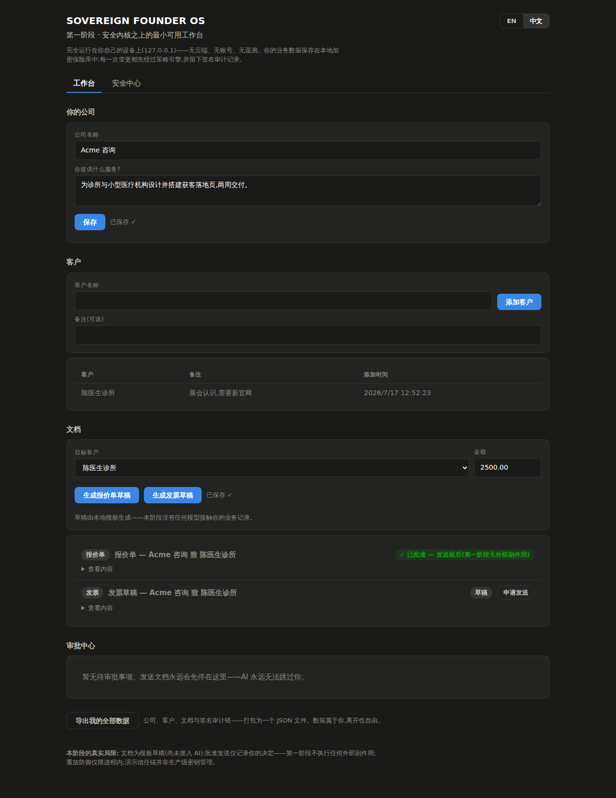
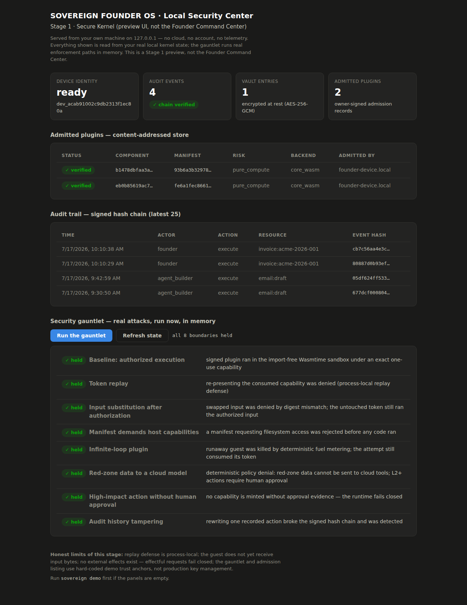

# Sovereign Founder OS

[](LICENSE)
[](ROADMAP.md)

> **Build and run your one-person company with AI—without giving up control of your data, decisions, or business.**

**Sovereign Founder OS** is an early-stage open-source AI operating system being built to help anyone start and run a one-person business while keeping their data, decisions, and business continuity under their control.

**[中文完整设计文档 →](docs/zh/README.md)**

---

## From Idea to Operating Business

The product vision guides a founder through the whole business loop, without requiring them to configure agents or understand software infrastructure:

```text
Understand the founder and their strengths
  → Find a viable business direction
  → Choose customers and validate their problems
  → Design the offer, product, and pricing
  → Decide today's most important work
  → Assemble an AI crew and execute
  → Win customers and collect feedback
  → Manage delivery, contracts, revenue, and risk
  → Improve the company continuously
```

Users see goals, decisions, approvals, progress, and the next action—not agent parameters, token counts, or tool schemas.

## Planned Product System

| Module | What it is designed to help the founder do |
| --- | --- |
| **Venture Studio** | Discover opportunities, validate customer problems, choose a business model, position an offer, and design pricing experiments |
| **AI Crew** | Bring together product, research, development, design, marketing, sales, support, finance, legal, and security roles for the task at hand |
| **Product & Delivery** | Build websites, prototypes, software, content, client deliverables, plans, and repeatable services |
| **Customers & Growth** | Define customers, manage leads and CRM, create campaigns and proposals, follow up, sell, and learn from feedback |
| **Finance, Legal & Tax** | Track income, expenses, invoices, cash flow, tax reserves, contracts, obligations, and professional escalation needs |
| **Founder Command Center** | Show company stage, current risks, key metrics, pending approvals, unvalidated assumptions, and the three most important next actions |
| **Sovereign Trust Layer** | Keep data, permissions, evidence, model choice, recovery, and the founder's right to exit under user control |

The **Sovereign Enterprise Graph** will be the structured source of truth beneath these modules: the founder, products, customers, projects, contracts, invoices, knowledge, metrics, risks, and decisions—not a pile of chat history.

## Scope and First Users

The first users are people exploring or operating a one-person business: freelancers, independent consultants and creators, digital service providers, and Micro-SaaS founders. The initial jurisdiction focus is Singapore, with expansion intended through versioned Jurisdiction Packs.

Sovereign Founder OS is not a multi-agent chat room, an autonomous lawyer, or a substitute for a founder's judgment and licensed professional advice. It will not put personal business data on a blockchain or promise absolute security.

## Why Sovereign

Business automation becomes dangerous when a model, plugin, cloud account, or platform can quietly become the owner. Sovereign Founder OS is designed so that useful AI assistance does not require that surrender:

- Data and authoritative business state must remain user-controlled and portable
- The system is designed to be local-first and independent of any one model or provider
- AI must not grant itself authority; important actions must require independently enforced policy and, when needed, human approval
- Plugins and external content must be treated as untrusted by default
- Important actions must leave tamper-evident, understandable evidence
- Workflows are designed to recover from model, process, node, and provider failure
- Core security, export, audit, and recovery will not be premium-only features
- Security limitations must be stated openly; the project will not claim absolute security

> **Defining demo target:** Kill the model, the server, and the plugin. **The company keeps running.**

Read the **[Sovereign Founder OS Manifesto →](MANIFESTO.md)** for the principles we will not compromise.

## One Product, Clear Names

| Name | Role |
| --- | --- |
| **Sovereign Founder OS** | The complete product and the project's only primary brand |
| **AI Crew** | The user-facing team of AI roles assembled for a business goal |
| **Crew Orchestrator** | The internal subsystem that selects, constrains, coordinates, and dissolves each AI crew |
| **Sovereign Trust Layer** | The cross-cutting product layer for privacy, authority, audit, resilience, and data sovereignty |
| **Sovereign Runtime** | The underlying local-first, model-neutral runtime that implements the Trust Layer and controlled execution |
| **Sovereign Founder OS Manifesto** | The project's public position and non-negotiable principles |

### Core Concepts

| Concept | Description |
| --- | --- |
| **Sovereign Enterprise Graph** | Canonical structured digital twin of the company — not chat history |
| **Mutually Constrained Autonomy** | Planner, Policy Guard, Executor, Auditor, Recovery Controller, Human Owner — no single node holds all power |
| **Capability Tokens** | Short-lived, scoped execution permissions; durable token revocation is a target capability |
| **Resilient Trust Mesh** *(planned)* | Target multi-node trust architecture; the Recovery Mesh is its replication and failover subsystem |

## Documentation

### Recommended Reading Path

[README](README.md) → [MANIFESTO](MANIFESTO.md) → `WHITEPAPER` *(planned)* → [ARCHITECTURE](ARCHITECTURE.md) → [THREAT MODEL](THREAT_MODEL.md) → [RFCs](rfcs/) → [ROADMAP](ROADMAP.md) → `DEMO` *(planned)*

### Quick Start (English)

| Document | Description |
| --- | --- |
| [MANIFESTO.md](MANIFESTO.md) | The Sovereign Founder OS position and non-negotiable principles |
| [ARCHITECTURE.md](ARCHITECTURE.md) | System architecture |
| [THREAT_MODEL.md](THREAT_MODEL.md) | Threat model v0.1 |
| [ROADMAP.md](ROADMAP.md) | Development roadmap (Stage 0–7) |
| [docs/INDEX.md](docs/INDEX.md) | Full documentation map |

### Design Notes and Project History

Specialist designs, product drafts, positioning, and historical documents live under [`docs/`](docs/INDEX.md). They provide context; the core documents and accepted RFCs are authoritative when material conflicts.

## Tech Stack (Planned)

| Layer | Technology |
| --- | --- |
| Sovereign Runtime | Rust |
| Desktop UI | TypeScript + React + Tauri |
| Agent Workers | Python (isolated, untrusted boundary) |
| Protocols | JSON Schema, gRPC, WASI, MCP, A2A |

## See It

The local app (`sovereign ui`, English/中文) — your business state in an
encrypted local vault, every send request stopped for human approval, and a
one-click attack gauntlet where every denial is a real enforcement path:

| Founder Workspace (工作台) | Security Center |
| --- | --- |
|  |  |

## Quick Start

With Rust installed:

```bash
git clone https://github.com/IcantFind-a-username/Sovereign-Founder-OS
cd Sovereign-Founder-OS
cargo run -p sovereign-cli -- ui     # opens http://127.0.0.1:7787
```

Prebuilt binaries for Linux, macOS, and Windows are attached to
[GitHub Releases](https://github.com/IcantFind-a-username/Sovereign-Founder-OS/releases)
when versions are tagged — download, unpack, and run `sovereign ui`.

## Current Status

**Stage 1: Secure Kernel** — in active development.

```text
crates/
  contracts/      shared types (events, tokens, policy)
  identity/       device keys and signing
  artifact/       signed manifests, exact invocation preparation, local admission store
  audit-ledger/   append-only signed event log
  authority/      durable cross-process one-use consumption (tokens, approvals, idempotency)
  execution/      crash-safe execution journal (durable intent, Indeterminate recovery)
  effects/        audited local outbox file-write broker (first host effect)
  model/          model gateway: routing, health, failover, disclosure records
  workflow/       durable checkpointed workflows with idempotent crash resume
  policy/         deterministic permission engine
  capability/     legacy V1 and exact-bound Capability V2 tokens
  vault/          local encrypted storage
  sandbox/        Phase A isolation + verified V2 pure-compute path
apps/
  cli/            sovereign CLI
```

Run locally:

```bash
cargo test --workspace
cargo run -p sovereign-cli -- init
cargo run -p sovereign-cli -- sandbox-check
cargo run -p sovereign-cli -- demo          # add --fast to skip the pauses
cargo run -p sovereign-cli -- ui            # local app at http://127.0.0.1:7787
cargo run -p sovereign-cli -- model-check   # model failover + Red-data guard
cargo run -p sovereign-cli -- workflow-demo # crash-safe workflow resume
cargo run -p sovereign-cli -- verify-export backup.json  # offline backup verification
```

`demo` is a story-driven walkthrough of the secure kernel: it creates your
local trust root, installs a signed plugin through publisher verification and
local admission, executes it under an exact one-use Capability V2 inside the
Wasmtime sandbox, records signed audit evidence, and then runs a seven-attack
gauntlet (supply-chain tampering, token replay, input substitution, greedy
manifests, infinite loops, red-data exfiltration, approval bypass, and audit
tampering) — every denial is a real enforcement path, not a mock.

`ui` serves the local app on 127.0.0.1 only (English/中文). It has three views:

- **Command Center** — the product face: your business at a glance (company,
  customers, documents), the decisions waiting only on you (approve or reject in
  place), and a kernel-evidence panel (audit-chain health, signed approvals,
  model disclosures, admitted plugins). It is strictly read-only aggregation —
  every number is re-derivable from your export, and opening the view writes
  nothing and makes no new claim.
- **Workspace** — the first usable product slice: create your company profile,
  add customers, generate offer and invoice drafts (local templates, no model),
  ask the local drafting assistant (deterministic, not an LLM, routed through
  the resilient model gateway) to suggest outreach text — a suggestion that is
  never saved to authoritative state and whose only footprint is an audited
  disclosure — request to send a document (which always stops in the Approval
  Center for the human owner), export every byte of your business state as one
  JSON file, and verify any such backup — this machine or another — entirely
  offline (format, the audit history's cryptographic binding to the device that
  signed it, and full re-computation of the signed chain). State lives in the
  encrypted vault; every change passes the policy engine and appends a signed
  audit event. Approving a send authorizes one exact sandboxed execution that
  composes the document into a well-formed RFC 5322 email and writes it to a
  local `outbox/*.eml` file (a real, audited host effect) — addressed to the
  customer's email if set, otherwise an RFC 2606 placeholder, and always marked
  "composed locally, not transmitted" — and records the signed evidence;
  Stage 1 performs no *network* effects — nothing leaves the device. The effect
  is genuinely revocable: revoking an approved send deletes the `.eml` and
  records a signed `effect.revoked` event, while the approval evidence is kept
  as history.
- **Security Center** — device identity, vault entries, admitted plugins
  (verified from the content-addressed store), the signed audit chain, and a
  one-click in-memory run of the attack gauntlet.

The server binds loopback only, rejects foreign `Host` headers
(DNS-rebinding defense), and requires `application/json` bodies on mutations
(CSRF defense). It exposes no secrets and never leaves your machine.

The isolated paths currently permit import-free pure computation only. Environment, filesystem, network, WASI, and every other host import are denied. The Phase B foundation verifies role-separated publisher signatures, owns the exact artifact bytes, canonicalizes and binds security-relevant input and resources, and requires an exact one-use Capability V2 before the verified Wasmtime path starts. Replay state is process-local by default and durable when the Authority Store is attached (the workspace app attaches it); the current core-Wasm ABI does not deliver canonical input to the guest.

The artifact crate now also provides the local admission transaction: an owner-controlled content-addressed store plus a locally signed admission record (`artifact-admission` COSE role) that promotes a publisher-verified artifact to an `AdmittedArtifact`, with every load re-deriving digests from the stored bytes. The verified executor does not yet require the admitted handle.

This is not a production plugin boundary or a completed Phase B. `sandbox-check` remains a mechanical Phase A check using an ephemeral test issuer—not a production trust anchor, and `demo` uses hard-coded demo keys. Executor consumption of admitted artifacts, a killable compilation worker and trusted cache, a durable Authority Store, the Component/WIT input ABI, crash-safe evidence, and audited host effects remain unimplemented. The demo performs no external effects; effectful requests fail closed. See [RFC 0002](rfcs/0002-wasm-sandbox-and-plugin-capabilities.md).

See [ROADMAP.md](ROADMAP.md) for the full development plan.

## Contributing

We welcome contributions from founders, product designers, Rust developers, agent framework developers, security researchers, privacy engineers, and domain experts. Start with [CONTRIBUTING.md](CONTRIBUTING.md), which explains how to find a useful first contribution.

Report security issues via [SECURITY.md](SECURITY.md) — do not open public issues for vulnerabilities.

## License & Intellectual Property

- **Code and documentation:** [Apache License 2.0](LICENSE)
- **Attribution:** [NOTICE](NOTICE)
- **Trademarks:** [TRADEMARK.md](TRADEMARK.md) — "Sovereign Founder OS" and related marks are protected

You are free to use, modify, and distribute this project under Apache 2.0 terms. Forks must retain license and attribution notices. Trademark use requires compliance with our trademark policy.

## Links

- Repository: https://github.com/IcantFind-a-username/Sovereign-Founder-OS
- Documentation index: [docs/INDEX.md](docs/INDEX.md)
- Why not another agent?: [docs/positioning/why-not-another-agent.md](docs/positioning/why-not-another-agent.md)

---

<p align="center">
  <strong>Designed for many models. Dependent on no single provider.</strong><br>
  <strong>Cryptographically verifiable. Founder-controlled by design.</strong>
</p>
